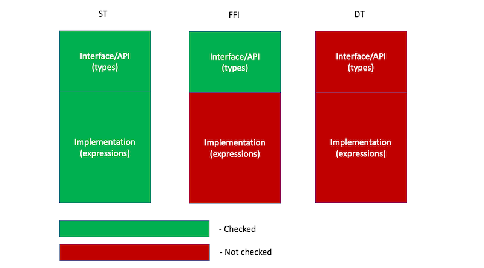

# 3. ST/FFI/DT modes

Erl1+ prototype (as of today) supports three new dialects.
A special pragma is used for specifying dialects:

```erlang
% statically typed erl2
-lang([erl2, st]).
-module(st_module).

% dynamically typed erl2
-lang([erl2, dt]).
-module(dt_module).

% erl2 ffi
-lang([erl2, ffi]).
-module(ffi_module).

% dynamically typed erl2 is default,
% this is the same as -lang([erl2, dt]).
-lang([erl2]).
-module(erl2_module).
```

## TL;DR Semantics (or rules of the game)

What is the difference between theses three dialects?

There are two points: compilation (translation to classic Erlang) and
type-checking.

* For compilation there is no difference: all three dialects are translated
  (transpiled) exactly the same way into classic Erlang.
* For type-checking there is some difference in what is type-checked or not.
    * DT code is not type-checked at all.
    * FFI code: all type definitions and specs are type-checked for correctness.
      Function bodies are not type-checked.
    * ST code: everything is type-checked.

Aside note:

* All public (exported functions) in ST and FFI modules should be annotated
  with specs. It is a type-error if there is a public function without a spec.

Schematically:




## Notes

### Syntax is reused

In erl1+ we are taking shortcuts, - we build erl1+ atop of erl1, - so we re-use
syntax for expressions and syntax for types (specs) with some additions.
The most noticeable additions are enums and polymorphic records.

### Current approach: simplicity, clarity, explicitness

The current approach:

* Within the same file all expressions are treated the same way
* Within the same file all type definitions and specs are treated the same way.
* The dialect (implying the rules of the game) is fixed for the whole module.

### What can use what

Corollary of the semantics.

* erl1+ ST:
    * erl1+ ST code (both types and expressions) can reference another
      erl1+ ST erl2 code (types and funs) and erl1+ FFI code (types and funs).
* erl1+ FFI:
    * FFI types (in type definitions and specs) can reference other types
      defined in erl1+ ST modules and in erl1+ FFI modules.
    * Code (expressions) in FFI modules can reference funs from anywhere.
* erl1+ DT:
    * erl1+ DT types can reference anything.
    * erl1+ DT code can reference funs from anywhere.

### What cannot be done (with the current approach)

The price of simplicity and explicitness is less flexibility.

* Inside ST module you cannot write any dynamic code. If you need to call any
  dynamic code from ST, you have to create an FFI module.
* Inside ST module you cannot introduce explicit types
  (even for the sake of documenting the things) which are not accepted by
  erl1+ ST type-checker.
* If inside an FFI module for some reason you need to use something like
  `{ok, any()} | {error, term}` you can’t, you need to extract it into a DT
  module. But you can have *private* functions which return such value
  (but these functions should be *without* specs).

Possibly, with such approach FFI modules should be as thin as possibly -
literally being just bridges between ST and DT worlds.
